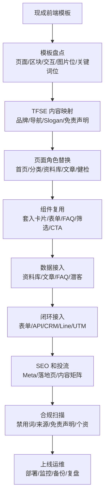
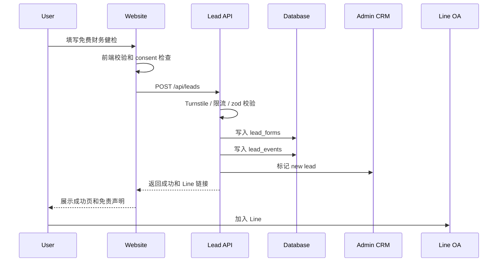
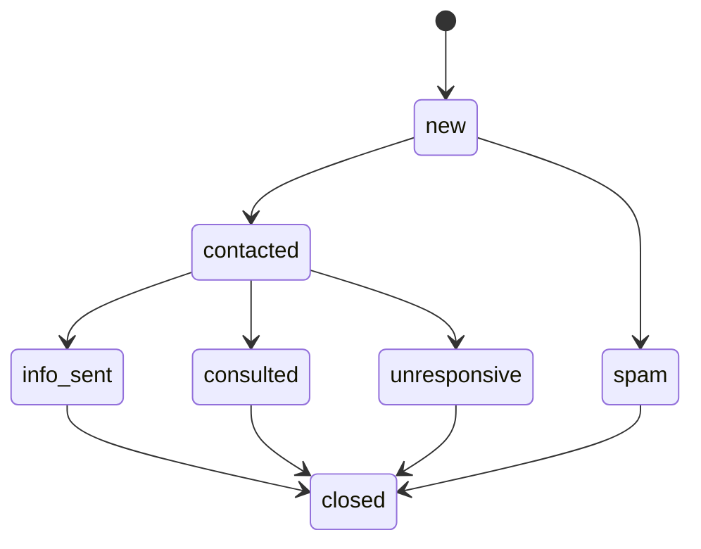

# TFSE金融独立站现成前端模板套用 0-1 完整项目计划

生成日期：2026-06-27  
适用前提：当前没有完整业务源码，但已有一个网站前端模板。模板中已经包含 UI 交互、布局区块、关键词位置、图片占位和基础页面预设，不需要重新设计整套视觉，只需要把 TFSE 的品牌、内容、资料库、表单、SEO、后台和合规闭环套进现有模板。  
项目名称：TFSE台灣金融便民資訊服務中心  
英文名称：Taiwan Financial Search Engine  
简称：TFSE金融便民中心

> 本文档不是“重新做 UI”的计划，而是“用现成前端模板承载 TFSE 项目闭环”的执行文档。核心工作是识别模板已有的页面、区块、交互、关键词栏位、图片占位和表单位置，然后把 TFSE 的金融便民定位、资料库结构、免费财务健检查询表单、Line 私域、SEO 内容、后台 CRM 和合规机制准确套进去。

---

## 1. 项目定位

### 1.1 一句话定位

TFSE 是台湾金融便民资讯查询独立站，整合银行、合法融资公司、储蓄互助社、债务法令、防诈宣导等公开资讯，通过数据库查询、知识内容、免费财务健检表单和 Line 私域承接，帮助民众识别合法金融资讯并避开非法代办。

### 1.2 站点不是什么

必须从第一天写进产品边界：

- 不是银行。
- 不是放款机构。
- 不是贷款代办。
- 不代收证件。
- 不保证核贷。
- 不承诺额度、利率、速度。
- 不以“内部管道”“包过”“快速放款”作为卖点。

### 1.3 站点真正要完成什么

1. 建立一个可信的金融资讯入口。
2. 建立可持续扩展的金融商品资料库。
3. 建立面向不同人群的查询和内容路径。
4. 建立免费财务健检表单，收集低敏潜客资料。
5. 建立 Line 官方帐号承接与分群。
6. 建立后台 CRM，跟踪潜客来源、需求、状态。
7. 建立 SEO 内容系统，长期吃自然流量。
8. 建立投流落地页系统，承接广告流量。
9. 建立合规审核机制，避免贷款代办和夸大营销风险。
10. 建立数据复盘机制，持续优化页面、文章、广告和表单。

---

## 2. 从现成前端模板开始的整体路线

### 2.1 这次不做什么

因为模板已经有 UI 交互、页面区块、关键词布局和图片占位，开发阶段不要重复做这些事情：

1. 不重新设计整套 UI 风格。
2. 不推翻模板现有布局。
3. 不重新造通用按钮、卡片、轮播、图片占位、FAQ、表单样式。
4. 不把模板的交互动画全部删除重写。
5. 不先做复杂视觉动效。
6. 不在没完成内容映射前改大面积 CSS。

正确做法是：先盘点模板，再映射 TFSE 内容，再补业务数据和闭环。

### 2.2 模板需要承接的能力

现成模板通常已经解决“长什么样”和“怎么交互”。TFSE 需要往里套的是业务层：

| 层级 | 要补齐的内容 |
|---|---|
| 品牌层 | Logo、品牌名称、Slogan、免责声明、合规文案 |
| 页面层 | 把模板已有页面改成首页、分类页、数据库页、文章页、表单页、合规页 |
| 组件层 | 复用模板已有导航、卡片、图片位、交互区块、按钮、表单、FAQ |
| 数据层 | 金融机构、商品资讯、文章、FAQ、潜客、事件 |
| 后端层 | API、表单提交、后台管理、权限、日志 |
| 增长层 | SEO、广告落地页、社媒入口、Line 私域 |
| 合规层 | 禁用词、来源核验、隐私同意、审核流程 |
| 运维层 | 部署、监控、备份、安全、性能、上线检查 |

### 2.3 模板套用总流程



### 2.4 模板盘点表

拿到模板后先填这张表，不要直接改。

| 模板内容 | 需要记录什么 | TFSE 套用方式 |
|---|---|---|
| 首页 Hero | 标题、副标题、CTA、图片位 | 放 TFSE 品牌、主 Slogan、查询入口 |
| 分类卡片区 | 卡片数量、图标、链接 | 映射房贷、信贷、车融、分期、储互社、债务法令 |
| 图文区块 | 图片比例、文字长度、按钮 | 放防诈、公信、资料库价值 |
| 数据/统计区 | 数字位、标签位 | 放资料库覆盖、资讯更新、合规边界，不写夸大数据 |
| 表单区 | 字段样式、提交按钮、校验 | 改成免费财务健检表单 |
| FAQ 区 | 问答数量、折叠交互 | 放合规问答和用户常见问题 |
| Blog/News | 列表样式、详情页 | 改成金融知识内容中心 |
| Gallery/Images | 图片占位数量 | 放 Logo、官方宣导、情境插图 |
| CTA 横幅 | 按钮和标题 | 改成免费财务健检查询和 Line 承接 |
| Footer | 栏位数量 | 放免责声明、隐私、来源政策、社媒 |

---

## 3. 品牌体系

### 3.1 固定品牌信息

- 中文全名：台灣金融便民資訊服務中心
- 英文标准名：Taiwan Financial Search Engine
- 国际缩写：TFSE
- 官网 / 社媒简称：TFSE金融便民中心

### 3.2 Slogan

主 Slogan，放在官网顶部、Logo 旁、首页首屏：

> 彙整全台合法銀行、儲蓄互助社金融資訊｜免費查詢、財務法令免費諮詢

短 Slogan，放在广告标题、社媒封面、移动端短句：

> 一站式金融便民資訊查詢平台

防诈公信力 Slogan，放在表单、页脚、公信力专区：

> 中立資訊整合，拒絕非法代辦，守護民眾財務安全

### 3.3 全站强制免责声明

所有页面、表单、商品详情、文章底部、落地页底部都必须出现：

> 本中心僅彙整公開合法金融商品與法令資訊，非銀行、放款機構、貸款代辦單位；所有融資、貸款業務須民眾親自洽詢合法金融機構辦理。

### 3.4 文案允许词和禁用词

允许词：

- 便民服務
- 資訊彙整
- 法令宣導
- 民眾諮詢
- 合法金融機構
- 資訊查詢
- 銀行商品
- 融資公司
- 儲蓄互助社方案
- 財務健檢
- 金融防詐
- 公開資訊整理
- 親洽合法金融機構

禁用词：

- 代辦
- 包過
- 快速放款
- 內部管道
- 額度保證
- 保證核貸
- 辦貸
- 秒審
- 免審核
- 不看聯徵
- 黑戶可過
- 低利保證
- 代收證件
- 送件

注意：“送件”在金融业务上下文中容易被理解为代办送件，站内尽量不用。

---

## 4. 模板视觉套用规范

### 4.1 原则：不重设 UI，只做品牌校准

现成模板已经有 UI 交互、布局、图片占位和关键词栏位。这里的目标不是重新设计，而是把模板校准到 TFSE 的金融便民定位。

保留：

- 模板现有页面骨架。
- 模板现有响应式断点。
- 模板现有卡片、按钮、FAQ、轮播、图文区块。
- 模板现有交互节奏。
- 模板现有图片尺寸和占位比例。
- 模板现有关键词/标题/副标题位置。

只修改：

- Logo。
- 品牌色变量。
- 文案。
- 导航。
- 按钮语义。
- 图片素材。
- 表单字段。
- 数据来源。
- 合规提示。

### 4.2 视觉方向

关键词：

- 稳重
- 清晰
- 中立
- 公信
- 易查
- 不焦虑
- 不诱导

不要把模板改成：

- 红黄大按钮贷款广告风
- 高饱和渐变营销风
- 满屏“马上申请”
- 夸张倒计时
- 伪官方背书
- 过度可爱圆角卡片

### 4.3 Logo 应用

已有 Logo 视觉为盾牌、房屋、蓝绿金融、金色环形托底。页面应用方式：

- Header 左侧使用 Logo + `TFSE金融便民中心`。
- 首页首屏可放完整 Logo。
- 小尺寸移动端只显示盾牌图标 + TFSE。
- 页脚放 Logo + 全称 + 免责声明。
- Open Graph 图片使用 Logo + 短 Slogan。

### 4.4 色彩 Token

如果模板已有 CSS 变量，直接把下列颜色映射到模板变量。不要重写整套样式。如果模板没有变量，再建立 `src/styles/tokens.css`。

```css
:root {
  --tfse-navy: #10185a;
  --tfse-blue: #0788c8;
  --tfse-blue-deep: #005b98;
  --tfse-green: #68b82e;
  --tfse-green-deep: #3f8a20;
  --tfse-gold: #d6a12b;
  --tfse-ink: #172033;
  --tfse-muted: #667085;
  --tfse-subtle: #8a94a6;
  --tfse-line: #d9dee8;
  --tfse-bg: #f7f6f1;
  --tfse-surface: #ffffff;
  --tfse-surface-alt: #f3f6f8;
  --tfse-success: #2e7d32;
  --tfse-warning: #b7791f;
  --tfse-danger: #b42318;
  --tfse-info: #175cd3;
  --tfse-radius-sm: 4px;
  --tfse-radius-md: 8px;
  --tfse-radius-lg: 12px;
  --tfse-shadow-soft: 0 8px 24px rgba(16, 24, 90, 0.08);
  --tfse-shadow-card: 0 4px 14px rgba(23, 32, 51, 0.08);
}
```

### 4.5 字体

如果模板已有字体系统，优先保留。只有当模板字体明显不适合繁体中文金融内容时，再替换为：

- 中文主体：`Noto Sans TC`
- 中文标题：`Noto Sans TC` 700 或 `Noto Serif TC`
- 数据和数字：`Noto Sans TC` + `font-variant-numeric: tabular-nums`
- 英文缩写：使用同字体，不额外切换花哨字体

加载方式，按模板技术栈接入：

```html
<link rel="preconnect" href="https://fonts.googleapis.com">
<link rel="preconnect" href="https://fonts.gstatic.com" crossorigin>
<link href="https://fonts.googleapis.com/css2?family=Noto+Sans+TC:wght@400;500;700;900&family=Noto+Serif+TC:wght@700&display=swap" rel="stylesheet">
```

### 4.6 间距和圆角

优先沿用模板现有 spacing 和 container。只在出现以下问题时局部调整：

- 中文标题换行难看。
- 卡片内文溢出。
- 按钮文字装不下。
- 表单移动端横向溢出。
- 图片占位比例裁切 Logo 或官方宣导图。

建议上限：

- 卡片圆角不超过 8px。
- 按钮圆角不超过 8px。
- 正文内容宽度控制在 720-820px。
- 数据库列表最大宽度控制在 1120-1200px。

### 4.7 图片占位套用

模板已有图片占位时，按类型替换：

| 模板图片位 | TFSE 替换内容 |
|---|---|
| Hero 主图 | TFSE Logo / 金融查询面板截图 / 公信服务情境图 |
| Feature 图标 | 房贷、信贷、车融、分期、储互社、债务法令图标 |
| About 图片 | 资料库、公开资讯、民众查询、金融防诈 |
| Banner 背景 | 低饱和蓝绿金融图，避免现金、钞票、急迫贷款图 |
| Blog 图片 | 文章主题图，使用金融知识、防诈、资料查询方向 |
| CTA 图片 | Line 咨询、免费财务健检查询、公开资料查询 |

禁用图片方向：

- 大把现金。
- 握手成交。
- 夸张借贷广告。
- “秒拿钱”类素材。
- 暗示官方机构背书但无授权的图片。

### 4.8 组件状态

模板组件已有状态就沿用。需要确认每个关键组件都有：

- 默认状态
- hover 状态
- focus 状态
- disabled 状态
- loading 状态
- error 状态
- empty 状态

金融站点最怕“看起来能提交但没有反馈”。表单尤其要做清楚。

---

## 5. 技术选型

### 5.1 原则：跟随模板，不强行换栈

既然已经有前端模板，技术栈优先沿用模板。不要因为计划文档推荐 Next.js 就强行迁移。如果模板能正常启动、构建、部署，就在现有框架内套入 TFSE 业务。

先确认模板属于哪类：

| 模板类型 | 执行方式 |
|---|---|
| Next.js / React | 直接补页面、组件、API、Prisma 或外部后端 |
| Vue / Nuxt | 沿用页面和组件结构，接 API 和数据 |
| HTML / CSS / JS 静态模板 | 先做静态站，再接独立后端或表单服务 |
| Laravel / PHP 模板 | 直接用 Blade / Controller / DB 做完整闭环 |
| WordPress 模板 | 用自定义文章类型、表单插件、ACF 或自建插件承接 |

### 5.2 如果模板允许补全后端，推荐组合

- 前端：沿用模板框架
- UI：沿用模板现有样式系统
- 图标：优先用模板已有图标库，如没有再用 lucide
- 表单：框架内表单方案，React 可用 react-hook-form + zod
- 数据库：PostgreSQL
- ORM：按模板栈选择，Next.js 可用 Prisma，Laravel 用 Eloquent
- 后台：先做内置 Admin 页面，后续可换 CMS
- 认证：沿用模板认证，如没有再接 NextAuth / Supabase Auth
- 文件存储：Cloudflare R2 或 S3
- 部署：跟随模板部署方式
- 监控：Sentry
- 分析：GA4 + Search Console + Meta Pixel
- 防刷：Cloudflare Turnstile

### 5.3 最小可上线技术组合

如果要先快上线：

- 现有前端模板 + 静态 JSON 资料库
- 表单提交到 Supabase / Airtable / Google Sheet webhook
- Line 官方帐号手动承接
- 文章用 Markdown
- 后台先不做复杂权限，只做受保护的数据管理页

但这只是 MVP。完整闭环最终要有数据库和后台。

---

## 6. 模板目录接入方式

不要先重构整个模板目录。先找到模板现有目录，再把 TFSE 模块插入。原则是“少动模板底座，多加业务模块”。

如果模板是 Next.js，可参考以下增量目录：

```text
src/
  app/
    page.tsx
    layout.tsx
    globals.css
    database/page.tsx
    database/[type]/page.tsx
    products/[slug]/page.tsx
    articles/page.tsx
    articles/[slug]/page.tsx
    free-check/page.tsx
    about/page.tsx
    anti-fraud/page.tsx
    privacy/page.tsx
    terms/page.tsx
    disclaimer/page.tsx
    source-policy/page.tsx
    contact/page.tsx
    admin/
      page.tsx
      leads/page.tsx
      products/page.tsx
      articles/page.tsx
      compliance/page.tsx
  components/
    template/
      # 保留模板原组件，不随意删除
    brand/
      SiteHeader.tsx
      SiteFooter.tsx
      LogoMark.tsx
      TrustNoticeBar.tsx
    compliance/
      DisclaimerBox.tsx
      SourcePolicyNotice.tsx
      ForbiddenTermWarning.tsx
    finance/
      FinancialSearchPanel.tsx
      CategoryEntryGrid.tsx
      ProductCard.tsx
      ProductFilters.tsx
      ProductDetail.tsx
      VerificationStatusBadge.tsx
      SourceBadge.tsx
    forms/
      LeadForm.tsx
      ConsentCheckbox.tsx
      FormSuccessPanel.tsx
    content/
      ArticleCard.tsx
      ArticleLayout.tsx
      FAQBlock.tsx
    line/
      LineCtaPanel.tsx
    admin/
      AdminShell.tsx
      LeadTable.tsx
      ProductEditor.tsx
      ComplianceReviewPanel.tsx
  data/
    navigation.ts
    categories.ts
    audienceSegments.ts
    forbiddenTerms.ts
    seedProducts.ts
    seedArticles.ts
    faq.ts
  lib/
    seo.ts
    analytics.ts
    compliance.ts
    leadScoring.ts
    validators.ts
    db.ts
  styles/
    tokens.css
  prisma/
    schema.prisma
```

如果模板是 Vue / Nuxt / Laravel / WordPress，也照这个模块拆，但不要为了匹配上面目录而大搬家。

### 6.1 模板文件处理规则

1. 模板原始组件先保留。
2. 无关 Demo 文案替换为 TFSE 文案。
3. 无关 Demo 图片替换为 TFSE Logo、官方宣导、金融查询情境图。
4. 无关 Demo 数据替换为 seedProducts、seedArticles、faq。
5. 模板已有组件可包装，不要复制粘贴出两套。
6. 模板 CSS 只做变量映射和局部修正。
7. 大范围删除前先确认组件没有被其他页面引用。

---

## 7. 页面架构

### 7.0 页面套用方法

先把模板页面按角色重新命名，不急着新建一堆页面。

| 模板已有页面/区块 | TFSE 页面角色 |
|---|---|
| Landing / Home | 金融便民首页 |
| Features / Services | 六大金融需求入口 |
| Categories / Products | 全类金融商品资料库 |
| Product Detail / Service Detail | 金融资讯详情页 |
| Blog / News | 金融知识内容中心 |
| Contact / Lead Form | 免费财务健检页 |
| About | 关于我们 |
| FAQ | 合规问答和常见问题 |
| CTA Section | Line 私域和免费财务健检查询导流 |
| Footer | 免责声明、隐私、来源政策、社媒 |

如果模板没有某个页面，再新增。不要一开始推翻模板页面结构。

### 7.1 全站导航

桌面端建议一级导航：

1. 金融便民首頁
2. 全類金融商品資料庫
3. 房貸資訊
4. 信貸與企業融資
5. 車輛與分期
6. 儲蓄互助社
7. 債務法令
8. 防詐宣導
9. 免費財務健檢

移动端：

- 顶部 Logo + 菜单按钮 + 免费财务健检查询按钮。
- 菜单内分组：查询资料库、常见需求、法令防诈、关于与合规。

### 7.2 首页 `/`

目标：建立信任，快速引导查询和表单。

模块顺序：

1. 顶部信任条  
   文案：`中立資訊整合｜不代辦貸款｜不代收證件｜不保證核貸`

2. 首屏 Hero  
   标题：`TFSE金融便民中心`  
   副标题：`彙整全台合法銀行、儲蓄互助社金融資訊｜免費查詢、財務法令免費諮詢`  
   CTA：`開始免費財務健檢`、`查看金融商品資料庫`

3. 查询面板  
   字段：`我想了解`、`我的身份`、`所在地区`  
   输出：推荐分类和文章。

4. 三大数据库入口  
   银行金融商品专区、合法融资公司方案专区、储蓄互助社优惠资讯专区。

5. 六大用户入口  
   一般上班族、中小企业主、有房产持有者、车辆需求族群、基層在地民众、高负债债务族群。

6. 热门查询  
   信贷门槛、房贷二胎、车分期、卡债整合、前置协商、储互社。

7. 防诈公信区  
   解释禁用话术：包过、代办、内部管道、保证核贷。

8. 官方资源区  
   金管会、法扶、申诉与检举入口、公开资料来源政策。

9. 免费财务健检 CTA  
   强调“资讯整理与法令导引”，不写“办理”。

10. 页脚免责声明。

### 7.3 全类金融商品资料库 `/database`

目标：建立平台核心资产。

模块：

- 数据库说明
- 三大体系 Tab
- 搜索框
- 筛选器
- 结果列表
- 来源与更新时间说明
- 不确定适合哪类的健检 CTA

筛选器：

- 机构类型：银行、融资公司、储互社、法令资源
- 需求类型：房贷、信贷、企业周转、车融、消费分期、债务法令
- 用户类型：上班族、企业主、有房产、车主、高负债、在地民众
- 地区
- 核验状态
- 更新时间

### 7.4 三大资料库子页

1. `/database/banks` 银行金融商品专区
2. `/database/finance-companies` 合法融资公司方案专区
3. `/database/credit-unions` 储蓄互助社优惠资讯专区

每页结构：

- 分类说明
- 适合谁
- 常见误区
- 列表
- FAQ
- 免费财务健检查询 CTA
- 免责声明

### 7.5 分类页

必须做：

- `/mortgage` 合法房屋融資資訊區
- `/credit-loan` 個人/企業信用融資專區
- `/vehicle-finance` 車輛分期融資查詢區
- `/installment` 各式消費分期資訊專區
- `/credit-union` 合法儲互社資訊專區
- `/debt-law` 債務法令輔助資訊區
- `/insurance-finance` 信用卡、保險、理財資訊專區
- `/anti-fraud` 金管會金融防詐宣導專欄

每个分类页统一结构：

1. 分类标题和说明。
2. 合规边界说明。
3. 适合对象。
4. 常见需求。
5. 数据库条目。
6. 相关文章。
7. FAQ。
8. 表单 CTA。
9. 免责声明。

### 7.6 产品详情页 `/products/[slug]`

展示公开资讯，不能像贷款销售页。

字段：

- 机构名称
- 机构类型
- 资讯标题
- 分类
- 适合需求
- 公开资料摘要
- 可能适用对象
- 通常需自行向机构确认的事项
- 注意事项
- 官方来源链接
- 来源更新时间
- TFSE 复核状态
- 免责声明

详情页按钮：

- `查看官方來源`
- `回到資料庫`
- `不確定是否適合？做免費財務健檢`

禁止按钮：

- `立即辦理`
- `幫我送件`
- `馬上核貸`

### 7.7 免费财务健检页 `/free-check`

目标：获取潜客需求，但只收最小必要资料。

页面模块：

1. 标题：`免費財務健檢查詢`
2. 边界说明：不代办、不收证件、不保证核贷。
3. 表单。
4. 个人资料告知。
5. Line 加友说明。
6. 常见问题。
7. 免责声明。

表单字段：

- 称呼
- 手机
- Line ID，选填
- 所在地区
- 需求类型，多选
- 身份类型
- 收入型态
- 目前困扰，选填
- 来源页面，隐藏字段
- UTM 字段，隐藏字段
- 隐私权同意
- Line 资讯接收同意，独立勾选

不收：

- 身份证字号
- 证件照片
- 存折
- 银行账号
- 信用卡卡号
- 征信报告
- 薪资证明附件

提交成功页文案：

> 已收到您的免費財務健檢需求。TFSE 僅提供公開金融資訊整理與法令諮詢導引，不代辦貸款、不代收證件、不保證核貸。若需辦理金融業務，請親洽合法金融機構。

### 7.8 关于我们 `/about`

内容：

- 品牌使命
- 平台定位
- 三大资料库
- 为什么不是贷款代办站
- 对标说明：591 / Agoda / Booking / TFSE
- 资料来源和更新原则
- 团队联系

### 7.9 文章中心 `/articles`

栏目：

- 银行信贷
- 房贷与二胎
- 企业周转
- 车融与分期
- 储蓄互助社
- 债务协商
- 更生清算
- 防诈知识
- 财务健检说明

文章页底部必须有：

- 资料来源
- 更新日期
- 免责声明
- 相关文章
- 免费财务健检查询 CTA

### 7.10 合规页面

必须做：

- `/privacy` 隐私权政策
- `/terms` 使用条款
- `/disclaimer` 免责声明
- `/source-policy` 资料来源与更新政策
- `/contact` 联系我们

---

## 8. 组件清单

这里不是要求重写所有组件，而是给模板组件做业务映射。模板已有的组件优先复用，缺什么才补什么。

### 8.0 模板组件映射规则

| 模板组件 | TFSE 使用方式 |
|---|---|
| Navbar / Header | 改成 TFSE 导航 |
| Hero | 改成品牌首屏和查询入口 |
| Feature Cards | 改成金融分类入口 |
| Service Cards | 改成资料库条目或受众入口 |
| Tabs | 改成银行 / 融资公司 / 储互社 |
| Filter / Search | 改成资料库筛选 |
| Contact Form | 改成免费财务健检表单 |
| FAQ Accordion | 改成合规 FAQ |
| Blog Cards | 改成金融知识文章 |
| CTA Banner | 改成 Line 和免费财务健检查询 |
| Footer | 改成免责声明和政策链接 |

如果模板组件命名不同，按功能映射，不按名称硬套。

### 8.1 品牌组件

- `SiteHeader`，可由模板 Header 改造
- `SiteFooter`，可由模板 Footer 改造
- `LogoMark`，插入模板 Logo 位
- `TrustNoticeBar`，若模板有 TopBar 直接复用
- `MobileNav`，优先复用模板移动菜单

### 8.2 合规组件

- `DisclaimerBox`，新增或用模板 Alert/Notice 改造
- `SourcePolicyNotice`，用模板 InfoBox 改造
- `ForbiddenTermWarning`，后台使用
- `ComplianceFooter`，接入模板 Footer
- `ConsentCheckbox`，接入模板表单 checkbox

### 8.3 查询组件

- `FinancialSearchPanel`，用模板 Hero 表单或 Search Box 改造
- `CategoryEntryGrid`，用模板 Feature Grid 改造
- `AudienceSegmentCards`，用模板 Service Cards 改造
- `QuickNeedSelector`，如模板有 tabs/chips 直接复用

### 8.4 数据库组件

- `ProductFilters`，复用模板筛选器，没有再新增
- `ProductCard`，复用模板产品/服务卡片
- `ProductDetail`，复用模板详情页版型
- `SourceBadge`，新增小组件
- `VerificationStatusBadge`，新增小组件
- `EmptyResults`，复用模板 empty state
- `LastUpdatedLabel`，新增文本组件

### 8.5 表单组件

- `LeadForm`，由模板 Contact Form 改造
- `FormField`，沿用模板输入框
- `NeedMultiSelect`，若模板没有多选再新增
- `OccupationSelect`，沿用模板 select
- `RegionSelect`，沿用模板 select
- `FormSuccessPanel`，复用模板 success/thank-you 区块
- `LineCtaPanel`，复用模板 CTA Banner

### 8.6 内容组件

- `ArticleCard`，复用模板 Blog Card
- `ArticleLayout`，复用模板 Blog Detail
- `FAQBlock`，复用模板 FAQ Accordion
- `RelatedArticles`，复用模板 Related Posts
- `SeoBreadcrumbs`，如果模板已有 Breadcrumb 直接复用

### 8.7 后台组件

后台通常模板没有，需要新增：

- `AdminShell`
- `LeadTable`
- `LeadDetail`
- `ProductEditor`
- `ArticleEditor`
- `ComplianceReviewPanel`
- `AuditLogTable`

---

## 9. 数据模型

### 9.1 `institutions`

金融机构、官方资源、法扶等资料源。

| 字段 | 类型 | 说明 |
|---|---|---|
| id | uuid | 主键 |
| name | text | 名称 |
| type | enum | bank / finance_company / credit_union / government / legal_aid / other |
| region | text | 地区 |
| official_url | text | 官方网址 |
| registry_ref | text | 核验依据 |
| verification_status | enum | pending / verified / rejected / archived |
| last_verified_at | timestamp | 最近核验 |
| notes | text | 内部备注 |
| created_at | timestamp | 创建时间 |
| updated_at | timestamp | 更新时间 |

### 9.2 `financial_products`

金融商品或资讯条目。

| 字段 | 类型 | 说明 |
|---|---|---|
| id | uuid | 主键 |
| institution_id | uuid | 关联机构 |
| title | text | 标题 |
| slug | text | URL slug |
| category | enum | mortgage / credit_loan / business_loan / vehicle / installment / credit_union / debt_law / card / insurance / wealth |
| summary | text | 摘要 |
| target_audiences | text[] | 适合族群 |
| conditions_summary | text | 条件摘要 |
| fee_rate_note | text | 费用利率说明 |
| documents_note | text | 资料说明，不可写本站收件 |
| warnings | text[] | 注意事项 |
| source_url | text | 来源 |
| source_title | text | 来源标题 |
| source_updated_at | date | 来源更新日期 |
| verification_status | enum | pending / verified / needs_review / archived |
| publish_status | enum | draft / published / archived |
| created_at | timestamp | 创建时间 |
| updated_at | timestamp | 更新时间 |

### 9.3 `audience_segments`

用户分群。

| 字段 | 类型 | 说明 |
|---|---|---|
| id | uuid | 主键 |
| key | text | slug |
| name | text | 名称 |
| age_range | text | 年龄 |
| attributes | text[] | 属性 |
| needs | text[] | 需求 |
| pain_points | text[] | 痛点 |
| recommended_categories | text[] | 推荐分类 |

### 9.4 `articles`

SEO 文章和知识内容。

| 字段 | 类型 | 说明 |
|---|---|---|
| id | uuid | 主键 |
| title | text | 标题 |
| slug | text | URL |
| category | text | 分类 |
| summary | text | 摘要 |
| body | markdown | 正文 |
| seo_title | text | SEO 标题 |
| seo_description | text | SEO 描述 |
| keywords | text[] | 关键词 |
| references | jsonb | 来源 |
| author | text | 作者 |
| compliance_status | enum | pending / approved / rejected |
| publish_status | enum | draft / published / archived |
| published_at | timestamp | 发布时间 |
| updated_at | timestamp | 更新时间 |

### 9.5 `lead_forms`

潜客表单。

| 字段 | 类型 | 说明 |
|---|---|---|
| id | uuid | 主键 |
| display_name | text | 称呼 |
| phone | text | 手机 |
| line_id | text | Line ID |
| region | text | 地区 |
| needs | text[] | 需求 |
| occupation_type | text | 身份 |
| income_type | text | 收入型态 |
| message | text | 补充 |
| consent_privacy | boolean | 隐私同意 |
| consent_privacy_version | text | 同意版本 |
| consent_line | boolean | Line 同意 |
| source_channel | text | 来源渠道 |
| source_url | text | 来源页 |
| utm_source | text | UTM |
| utm_medium | text | UTM |
| utm_campaign | text | UTM |
| utm_content | text | UTM |
| utm_term | text | UTM |
| status | enum | new / contacted / info_sent / consulted / unresponsive / spam / closed |
| risk_flags | text[] | 风险标记 |
| assigned_to | uuid | 跟进人 |
| created_at | timestamp | 创建时间 |
| updated_at | timestamp | 更新时间 |

### 9.6 `lead_events`

潜客行为和跟进记录。

| 字段 | 类型 | 说明 |
|---|---|---|
| id | uuid | 主键 |
| lead_id | uuid | 关联潜客 |
| event_type | enum | form_submit / line_add / call / note / status_change / article_sent / info_sent |
| payload | jsonb | 事件 |
| created_by | uuid | 操作人 |
| created_at | timestamp | 时间 |

### 9.7 `compliance_reviews`

合规审核。

| 字段 | 类型 | 说明 |
|---|---|---|
| id | uuid | 主键 |
| entity_type | text | page / article / product / ad / message |
| entity_id | uuid | 对象 ID |
| forbidden_terms_found | text[] | 禁用词 |
| required_disclaimer_present | boolean | 是否有免责声明 |
| source_verified | boolean | 来源是否核验 |
| reviewer | text | 审核人 |
| decision | enum | approved / rejected / needs_revision |
| notes | text | 备注 |
| reviewed_at | timestamp | 审核时间 |

### 9.8 `audit_logs`

后台审计。

| 字段 | 类型 | 说明 |
|---|---|---|
| id | uuid | 主键 |
| actor_id | uuid | 操作人 |
| action | text | 操作 |
| entity_type | text | 对象类型 |
| entity_id | uuid | 对象 |
| before | jsonb | 修改前 |
| after | jsonb | 修改后 |
| ip | text | IP |
| user_agent | text | UA |
| created_at | timestamp | 时间 |

---

## 10. API 设计

### 10.1 前台 API

| API | 方法 | 用途 |
|---|---|---|
| `/api/products` | GET | 产品资讯列表 |
| `/api/products/:slug` | GET | 产品详情 |
| `/api/institutions` | GET | 机构列表 |
| `/api/articles` | GET | 文章列表 |
| `/api/articles/:slug` | GET | 文章详情 |
| `/api/leads` | POST | 提交免费财务健检查询 |
| `/api/events` | POST | 前台事件 |
| `/api/search` | GET | 全站搜索 |

### 10.2 后台 API

| API | 方法 | 用途 |
|---|---|---|
| `/api/admin/leads` | GET | 潜客列表 |
| `/api/admin/leads/:id` | GET | 潜客详情 |
| `/api/admin/leads/:id/status` | PATCH | 更新状态 |
| `/api/admin/products` | POST | 新增资料 |
| `/api/admin/products/:id` | PATCH | 更新资料 |
| `/api/admin/articles` | POST | 新增文章 |
| `/api/admin/articles/:id` | PATCH | 更新文章 |
| `/api/admin/compliance/review` | POST | 提交审核 |
| `/api/admin/audit-logs` | GET | 审计日志 |

### 10.3 表单提交流程



---

## 11. 后台 CRM

### 11.1 必须功能

第一版后台必须能：

1. 登录。
2. 查看潜客列表。
3. 搜索手机号或称呼。
4. 按需求标签筛选。
5. 按来源筛选。
6. 查看潜客详情。
7. 更新状态。
8. 添加备注。
9. 查看提交页面和 UTM。
10. 导出受权限控制。
11. 管理产品资料。
12. 管理文章。
13. 做合规审核。

### 11.2 角色权限

| 角色 | 权限 |
|---|---|
| Super Admin | 全部 |
| Content Editor | 文章和 FAQ |
| Data Manager | 金融资料库 |
| Compliance Reviewer | 审核内容和广告 |
| Consultant | 潜客查看和备注，不可删除 |
| Viewer | 只读报表 |

### 11.3 潜客状态



状态含义：

- `new`：新提交。
- `contacted`：已联系。
- `info_sent`：已发送公开资讯或官方资源。
- `consulted`：已完成资讯说明或法令导引。
- `unresponsive`：无回应。
- `spam`：垃圾或重复。
- `closed`：结案。

---

## 12. SEO 系统

### 12.1 SEO 策略

TFSE 不应只抢“贷款”大词。应建立三层流量：

1. 首页和导航承接品牌词和核心大词。
2. 分类页承接中长尾词。
3. 文章页和数据库详情页承接超细长尾词。

### 12.2 首页 SEO

Title：

> TFSE台灣金融便民資訊服務中心｜全台銀行、合法融資公司、儲蓄互助社貸款分期、債務協商中立資訊查詢平台

Description：

> TFSE金融便民中心中立彙整全台銀行、合法融資公司、儲蓄互助社、債務法令與金融防詐資訊，提供免費金融資訊查詢與財務健檢導引。

### 12.3 分类页 Title 模板

```text
{分類名稱}｜TFSE金融便民中心｜合法金融資訊查詢與免費財務健檢
```

### 12.4 文章页 Title 模板

```text
{文章標題}｜TFSE金融便民中心
```

### 12.5 核心关键词

核心大词：

- TFSE金融便民中心
- 台灣金融資訊查詢
- 合法銀行貸款比較
- 融資公司分期資訊
- 儲蓄互助社貸款
- 債務協商資訊
- 房貸信貸比價平台
- 財務健檢免費查詢

中长尾词：

- 全台銀行信貸方案查詢
- 公教人員專屬信貸條件
- 軍醫護信貸利率比較
- 中小企業銀行周轉金
- 首購房貸優惠專案
- 房屋轉貸增貸試算
- 合法融資公司車輛分期
- 中古車原車融資條件
- 各地儲蓄互助社信貸
- 卡債過高前置協商流程

超细长尾词：

- 上班族薪轉不足怎麼申辦銀行信貸
- 聯徵輕微遲繳銀行貸款條件
- 無房產如何整合多筆卡債
- 開店營業額低企業貸申辦技巧
- 中古機車原車融資利率試算
- 儲蓄互助社申貸資格限制
- 負債比超40%適合哪類融資
- 債務協商後還能辦信貸嗎
- 公教人員無擔保信貸額度上限

### 12.6 第一批内容规划

先做 40 篇，不要一次写 200 篇低质内容。

银行信贷：

1. 銀行信貸申請前要看哪些條件
2. 薪轉不足還能查詢哪些合法金融資訊
3. 聯徵紀錄對信貸條件的影響
4. 公教軍警醫護信貸資訊整理
5. 中小企業周轉金常見資料
6. 信貸利率資訊如何看懂
7. 無薪轉族群查詢金融資訊的方法
8. 企業主申請周轉資訊前要準備什麼

房贷：

9. 房屋轉貸與增貸差異
10. 二胎房貸與合法融資資訊如何分辨
11. 首購房貸常見條件
12. 房貸月付壓力如何做財務健檢
13. 有房產但卡債高該先看哪些資訊
14. 房屋二胎常見風險
15. 房貸轉貸前要確認的費用

车融和分期：

16. 車輛分期資訊查詢前要注意什麼
17. 中古車原車融資常見條件
18. 機車分期與消費分期差異
19. 裝潢與家電分期資訊整理
20. 合法融資公司資訊如何核驗
21. 車融利率資訊如何比較

储互社：

22. 儲蓄互助社是什麼
23. 儲互社與銀行貸款差異
24. 地方儲互社資訊查詢方式
25. 儲互社小額融資常見限制
26. 基層民眾如何判斷合法管道

债务法令：

27. 卡債過高可以先了解哪些法令程序
28. 前置協商流程入門
29. 更生與清算差異
30. 法律扶助基金會債務諮詢方式
31. 債務代辦話術如何辨識
32. 負債比過高時不要做的事

防诈：

33. 不代辦貸款為什麼更安全
34. 包過與保證核貸話術風險
35. 金融資訊查詢平台如何使用
36. 免費財務健檢會收哪些資料
37. 如何辨識非法代辦
38. 不收證件代表什麼
39. TFSE資料來源與更新原則
40. 找金融資訊前先看這份防詐清單

---

## 13. 广告落地页系统

### 13.1 落地页模板

每个广告主题一页，结构统一：

1. 痛点标题。
2. 合法资讯查询说明。
3. 不代办、不收证件、不保证核贷提示。
4. 三步流程：选择需求、查看资讯、填写健检。
5. 对应资讯卡片。
6. FAQ。
7. 表单。
8. Line CTA。
9. 免责声明。

### 13.2 第一批落地页

- `/lp/free-check`
- `/lp/credit-loan`
- `/lp/mortgage-second`
- `/lp/vehicle-installment`
- `/lp/credit-union`
- `/lp/debt-consult`
- `/lp/business-working-capital`
- `/lp/anti-fraud`

### 13.3 UTM 标准

```text
utm_source=facebook
utm_medium=paid_social
utm_campaign=free_check_2026q3
utm_content=salary_credit_a
utm_term=銀行信貸門檻
```

所有表单提交都要入库 UTM。

---

## 14. Line 私域闭环

### 14.1 加友欢迎语

```text
歡迎加入 TFSE金融便民中心。
本中心提供公開金融資訊整理、免費財務健檢與法令資訊導引。
我們不代辦貸款、不代收證件、不保證核貸。
請選擇您想了解的資訊類型：
```

按钮：

- 銀行信貸資訊
- 房屋融資資訊
- 車輛分期資訊
- 儲互社資訊
- 債務法令諮詢
- 免費財務健檢

### 14.2 Line 标签

- `need_credit_loan`
- `need_mortgage`
- `need_vehicle`
- `need_installment`
- `need_credit_union`
- `need_debt_law`
- `segment_employee`
- `segment_business_owner`
- `segment_property_owner`
- `segment_high_debt`
- `source_fb`
- `source_ig`
- `source_tiktok`
- `source_seo`
- `form_submitted`
- `consulted`

### 14.3 自动回复原则

每个需求回复都包含：

1. 边界说明。
2. 入门文章。
3. 数据库入口。
4. 免费财务健检查询入口。

不要求用户上传证件。

---

## 15. 合规机制

### 15.1 发布前检查

每个页面、文章、商品、广告都要跑：

1. 禁用词检查。
2. 免责声明检查。
3. 来源链接检查。
4. 更新时间检查。
5. 是否暗示核贷或代办。
6. 是否收集过度个资。

### 15.2 个人资料保护

表单必须明确告知：

- 收集单位。
- 收集目的。
- 收集资料类别。
- 使用期间、地区、对象、方式。
- 用户可查询、更正、停止利用、删除。
- 不提供资料的影响。

落地要求：

- 隐私同意不可预设勾选。
- Line 营销同意独立勾选。
- 记录同意版本。
- 支持删除请求。
- 后台导出要记录审计日志。

### 15.3 官方参考来源

上线前法务仍需复核。开发阶段可把这些作为资料来源政策的底层参考：

- 金管会广告业务招揽及营业促销活动办法，修正日期为民国 114 年 06 月 30 日。
- 金管会受理民众检举与陈情页面，提供金融违法案件检举和相关电话资讯。
- 法律扶助基金会消费者债务清理条例法律扶助页面，说明消债法律扶助和代办风险。
- 全国法规资料库个人资料保护法。

---

## 16. 开发任务拆解

### Phase 0：模板盘点与映射，1 天

任务：

- 确认模板框架。
- 安装依赖。
- 跑通本地启动和 build。
- 截图保存模板原始首页、列表页、详情页、表单页。
- 盘点模板已有页面。
- 盘点模板已有组件。
- 盘点模板已有图片占位。
- 盘点模板已有关键词栏位。
- 盘点模板已有交互。
- 建立 `TFSE_TEMPLATE_MAPPING.md`。

交付：

- 模板可启动。
- 模板功能清单完成。
- 每个模板页面对应 TFSE 目标页面。
- 每个模板区块对应 TFSE 内容。

### Phase 1：品牌内容套入，2-3 天

任务：

- 替换 Logo。
- 替换站名。
- 替换首页 Hero 文案。
- 替换导航。
- 替换模板 CTA 文案。
- 替换 Footer。
- 加入全站免责声明。
- 将模板主色映射到 TFSE 品牌色。
- 替换明显不合规图片。

交付：

- 模板仍保持原本 UI 结构。
- 所有页面展示 TFSE 品牌。
- 全站无原模板 Demo 品牌残留。
- 按钮文案合规。

### Phase 2：首页、合规页与模板占位替换，3-5 天

任务：

- 将模板首页完整改成 TFSE 金融便民首页。
- 将模板 About 改成关于我们。
- 将模板 Contact 改成免费财务健检入口或联系我们。
- 将模板 FAQ 改成合规 FAQ。
- 新增或改造免责声明。
- 新增或改造隐私权政策。
- 新增或改造使用条款。
- 新增或改造资料来源政策。

交付：

- 首页完整。
- 所有合规页面可访问。

### Phase 3：资料库前台套入，4-7 天

任务：

- 将模板 Products / Services 列表改成全类金融商品资料库。
- 将模板 Product Detail / Service Detail 改成金融资讯详情页。
- 用模板卡片承接资料库条目。
- 用模板 Tab 承接银行 / 融资公司 / 储互社。
- 用模板搜索或筛选组件承接资料筛选。
- 接入静态 seed 数据或数据库。

交付：

- 至少 30 条示例资料。
- 每条有来源和更新时间。

### Phase 4：免费财务健检查询表单套入，3-5 天

任务：

- 将模板 Contact Form 改成 LeadForm。
- zod 校验。
- Turnstile。
- UTM 捕捉。
- 表单提交 API。
- 成功页。
- Line CTA。

交付：

- 表单可提交。
- 数据可入库。
- consent 可记录。

### Phase 5：后台 CRM，5-10 天

任务：

- 登录。
- 后台布局。
- 潜客列表。
- 潜客详情。
- 状态更新。
- 备注。
- 产品资料管理。
- 文章管理。
- 合规审核。
- 审计日志。

交付：

- 管理员可处理潜客。
- 内容可发布前审核。

### Phase 6：SEO 内容中心套入，5-10 天

任务：

- 将模板 Blog 列表改成金融知识内容中心。
- 将模板 Blog Detail 改成文章详情。
- Markdown 渲染。
- SEO metadata。
- sitemap。
- robots。
- 内链。
- 第一批文章。

交付：

- 文章可发布。
- sitemap 可提交。

### Phase 7：广告落地页与追踪，3-6 天

任务：

- 复用模板 Landing 页面或 Hero 区块。
- 做 8 个广告页面。
- GA4。
- Meta Pixel。
- 事件追踪。
- UTM 报表。

交付：

- 广告流量可追踪到表单。

### Phase 8：上线和运维，2-4 天

任务：

- 部署。
- 域名。
- SSL。
- 404/500。
- Sentry。
- 备份。
- 性能检查。
- 移动端检查。
- 合规扫描。

交付：

- 生产站可访问。
- 核心闭环可跑通。

---

## 17. 验收清单

### 17.1 业务闭环

- [ ] 用户能从首页进入资料库。
- [ ] 用户能从分类页进入资料详情。
- [ ] 用户能从文章页进入免费财务健检查询。
- [ ] 表单提交后后台可见。
- [ ] 表单记录 UTM。
- [ ] 提交成功后可导向 Line。
- [ ] 后台可更新潜客状态。
- [ ] 管理员可维护资料库。
- [ ] 管理员可发布文章。
- [ ] 合规审核可记录。

### 17.2 UI 验收

- [ ] Logo 清晰。
- [ ] 颜色符合蓝绿金融和米白底。
- [ ] 页面没有贷款广告风。
- [ ] 按钮文案合规。
- [ ] 手机端导航清楚。
- [ ] 表单错误提示清楚。
- [ ] 空数据状态清楚。
- [ ] 页面不出现文字重叠。

### 17.3 合规验收

- [ ] 全站无禁用词。
- [ ] 每页有免责声明。
- [ ] 表单有隐私同意。
- [ ] Line 同意独立勾选。
- [ ] 不收证件。
- [ ] 不承诺核贷。
- [ ] 产品资料有来源。
- [ ] 产品资料有更新时间。
- [ ] 广告页无夸大承诺。

### 17.4 技术验收

- [ ] `npm run build` 通过。
- [ ] `npm run lint` 通过。
- [ ] 关键页面 200。
- [ ] 404 正常。
- [ ] 表单 API 有限流。
- [ ] 后台需要登录。
- [ ] 导出有权限。
- [ ] 错误上报可用。
- [ ] 数据库备份可用。

### 17.5 SEO 验收

- [ ] 首页 metadata。
- [ ] 分类页 metadata。
- [ ] 文章页 metadata。
- [ ] 产品页 metadata。
- [ ] sitemap。
- [ ] robots。
- [ ] canonical。
- [ ] Open Graph。
- [ ] 图片 alt。
- [ ] 内链。

---

## 18. 第一版 MVP 范围

如果时间紧，第一版只做：

1. 首页
2. 全类金融商品资料库
3. 三个资料库子页
4. 六个分类页
5. 免费财务健检查询表单
6. Line CTA
7. 关于我们
8. 隐私权政策
9. 免责声明
10. 资料来源政策
11. 10 篇文章
12. 后台潜客列表
13. UTM 追踪
14. 禁用词检查脚本

第二版再做：

1. 完整 CRM。
2. 高级筛选。
3. 产品编辑器。
4. 文章审核流。
5. 自动 Line 分群。
6. 广告落地页矩阵。
7. 报表中心。
8. 多管理员权限。

---

## 19. 现成前端模板接入顺序

拿到前端模板后，按这个顺序改：

1. 跑起来，确认启动命令和 build 命令。
2. 截图记录模板原始页面，方便后续对照。
3. 找到首页、列表页、详情页、Blog、Contact、FAQ、Footer。
4. 建立模板映射表：模板区块对应 TFSE 什么内容。
5. 替换 Logo、站名、Slogan、导航和 Footer。
6. 保留模板布局，把首页文案改成 TFSE 金融便民首页。
7. 把模板分类/服务区块改成金融需求入口。
8. 把模板 Products / Services 改成金融商品资料库。
9. 把模板 Detail 改成金融资讯详情页。
10. 把模板 Contact Form 改成免费财务健检表单。
11. 把模板 Blog 改成金融知识内容中心。
12. 把模板 FAQ 改成合规问答。
13. 替换图片占位，避免贷款广告风图片。
14. 接表单 API。
15. 接数据库或静态 seed 数据。
16. 建后台 CRM。
17. 加 SEO metadata、sitemap、robots。
18. 加 GA4、Meta Pixel、UTM。
19. 全站禁用词和免责声明扫描。
20. 移动端验收。
21. 上线。

优先级：

1. 先复用模板，再补业务。
2. 合规边界先于转化。
3. 表单闭环先于动效。
4. 数据结构先于大量内容。
5. SEO 架构先于文章数量。
6. 后台可维护先于漂亮后台。

---

## 20. 风险清单

| 风险 | 后果 | 处理 |
|---|---|---|
| 做成贷款代办风格 | 合规和信任风险 | 全站边界、禁用词、免责声明 |
| 表单收太多敏感资料 | 个资风险 | 只收最小必要资料 |
| 商品资料无来源 | 误导风险 | 来源链接和更新时间必填 |
| 利率条件过期 | 用户误判 | 核验状态和复核周期 |
| 后台权限过大 | 资料外泄 | 角色权限和审计日志 |
| SEO 内容重复 | 收录差 | 做问题导向文章 |
| Line 变销售骚扰 | 退订和投诉 | 自动回复以资讯为主 |
| 广告文案越界 | 广告封禁或法务风险 | 广告进入合规审核 |

---

## 21. 上线前最终检查

上线前必须逐项确认：

- [ ] 所有页面都有标题和描述。
- [ ] 所有页面都有免责声明或页脚免责声明。
- [ ] 免费财务健检查询表单不收证件。
- [ ] 所有 CTA 没有“代办、包过、保证核贷”。
- [ ] 所有产品资料有来源链接。
- [ ] 所有文章有更新日期。
- [ ] 隐私权政策可访问。
- [ ] 使用条款可访问。
- [ ] 资料来源政策可访问。
- [ ] 表单提交测试通过。
- [ ] 后台登录测试通过。
- [ ] 手机端测试通过。
- [ ] sitemap 可访问。
- [ ] robots 可访问。
- [ ] GA4 事件可收到。
- [ ] Search Console 已准备提交。
- [ ] 备份策略已启用。

---

## 22. 官方来源和上线前法务备注

本文档的合规建议用于产品和开发规划，不构成法律意见。正式上线前，需要台湾当地合规或法律人员复核，尤其是广告文案、表单字段、个资告知、金融资讯展示方式。

可参考来源：

1. 金融监督管理委员会主管法规系统，金融服务业从事广告业务招揽及营业促销活动办法：<https://law.fsc.gov.tw/LawContent.aspx?id=GL000327>
2. 金融监督管理委员会，受理民众检举与陈情：<https://www.fsc.gov.tw/ch/home.jsp?id=54&parentpath=0%2C6>
3. 金融监督管理委员会，检举金融违法案件专区：<https://fscmail.fsc.gov.tw/FSCReportCase/CRPages/Step1.aspx>
4. 法律扶助基金会，消费者债务清理条例法律扶助：<https://www.laf.org.tw/service-project-detail/20>
5. 法律扶助基金会，别轻易相信债务整合公司：<https://www.laf.org.tw/edu-detail/482>
6. 全国法规资料库，个人资料保护法：<https://law.moj.gov.tw/LawClass/LawAll.aspx?PCode=I0050021>

---

## 23. 最终判断

TFSE 这次不是从零画 UI，也不是做一个“贷款页面集合”。已有前端模板解决了外观、布局、交互、图片占位和关键词位置，真正要做的是把模板改造成一个有边界、有来源、有后台、有私域承接、有 SEO 资产的金融资讯查询系统。

从现成模板开始，最正确的建设顺序是：

1. 先盘点模板，把每个区块映射到 TFSE 页面和内容。
2. 再把品牌边界和合规底座钉死。
3. 再把首页、资料库、分类页、免费财务健检查询表单套进模板。
4. 再把潜客入库、后台、Line 承接串起来。
5. 再铺 SEO 内容和广告落地页。
6. 最后用数据复盘持续迭代。

这样做，站点才不是一个一次性页面，而是一个能长期增长、能持续维护、能降低合规风险的独立站资产。
